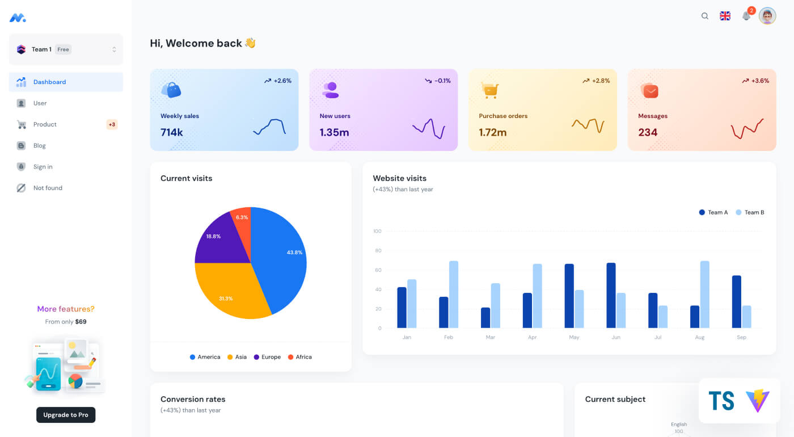

## Pages

- [Dashboard](https://free.minimals.cc/)
- [Users](https://free.minimals.cc/user)
- [Sign in](https://free.minimals.cc/sign-in)
- [Not found](https://free.minimals.cc/404)

## Quick start

- Clone the repo: `git clone https://github.com/giangann/timesheet-admin-web.git`
- Recommended: `Node.js v20.x`
- **Install:** `npm i` or `yarn install`
- **Config .env:** `cp .env.example .env`
- **Start:** `npm run dev` or `yarn dev`
- **Build:** `npm run build` or `yarn build`
- Open browser: `http://localhost:5173`

